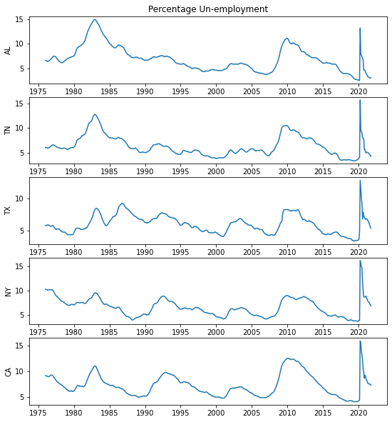
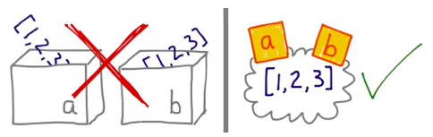
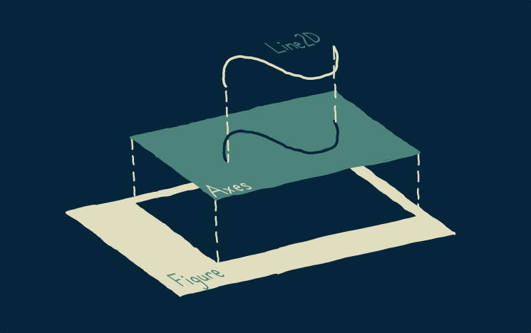
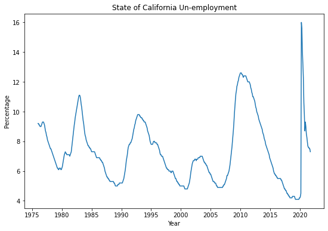

autoscale: true
footer: 

##[fit] Basic Python
##[fit] for Data Science

---


[.column]

Our aim in this workshop is to make you familiar with the basics of Python, focusing on those aspects that will jump-start your ability to write data-science programs.

In other words, we want to make you dangerous enough soon :-).

Accordingly, we will cover fundamental python concepts including variables, lists, dictionaries, iteration, and functions; moving on to useful list like objects such as Pandas Series and numpy ndarrays, and their use in analyzing and making plots of data. We will make a plot of unemployment rates in multiple American states. This example exercises all basic python concepts for data science..if you understand it you are golden!

[.column]

##[fit] 0. 
##[fit] What You 
##[fit] Will Learn


---

```python
#various imports of libraries

import numpy as np
import pandas as pd
import matplotlib.pyplot as plt
%matplotlib inline

# setting up plot sizes
width_inches = 9
subplot_height_inches = 2

# defining a function to load and clean unemployment data
def get_unemployment_data(state_abbrev):
    data = pd.read_csv("data/"+state_abbrev+"UR.csv")
    data['DATE'] = pd.to_datetime(data['DATE'])
    return data

# creating a dictionary the hold the data, with
# the lookup keys being the state abbreviations
states = ['AL', 'TN', 'TX', 'NY', 'CA']
state_data=dict()
for abbrev in states:
    state_data[abbrev] = get_unemployment_data(abbrev)
    
# plotting the data    
    
fig, ax = plt.subplots(nrows=len(states), 
                       figsize = (width_inches, subplot_height_inches*len(states)))
for i, state_abbrev in enumerate(states):
    data = state_data[state_abbrev]
    ax[i].plot(data['DATE'], data[state_abbrev+'UR'])
    ax[i].set_ylabel(state_abbrev)
ax[2].set_xlabel("Year")
ax[0].set_title("Percentage Un-employment");
```



---

##[fit] 1. Getting 
##[fit] Started

---

## Python as a calculator

$$\begin{array}{lll}
\text { Operator } & \text { Description } & \text { Example } \\
\hline+ & \text { adds values on either side } & 1.2+2=3.2 \\
- & \text { subtracts the right value from the left } & 1.2-0.2=1.0 \\
\star & \text { multiplies values on either side } & 1.2 * 2=2.4 \\
/ & \text { divides the left value by the right } & 4 / 2=2.0 \\
\% & \text { divides the left value by the right } & 4 \% 3=1 \\
& \text { and returns the remainder } & \\
\star \star & \text { exponentiate the left value by the right } & 3 \star \star 2=9 \\
/ / & \text { divides the left value by the right } & 3 / / 2=1 \\
& \text { and removes the decimal part } &
\end{array}$$

---

## Variables

[.column]

Variables are labels for values.

```python
Var = "hello"
```


[.column]

Python values have **types**, such as integer,
boolean, string, floating-point(real).

Input:

```python
var1 = 7
var2 = 7.01
var3 = "Hello World"
var4 = True
print(type(var1), type(var2))
print(type(var3), type(var4))
```
Output:

```
<class 'int'>, <class 'float'>
<class 'str'>, <class 'bool'>
```

---

## Conditionals

$$\begin{array}{lll}
\text { Operator } & \text { Description } & \text { Example }  \\
\hline== & \text { checks if values on either side are equal } & 1==2 \text { is
 False } \\
!= & \text { checks if values on either side are unequal } & 1 !=2 \text { is Tr
ue } \\
\gt & \text { checks if left value is greater } & 1 \gt 2 \text { is False } \\
\lt & \text { checks if left value is smaller } & 1 \lt 2 \text { is True } \\
\ge & \text { checks if left value is greater or equal } & 2 \ge 2 \text { is Tr
ue } \\
\le & \text { checks if left value is smaller or equal } & 1 \le 2 \text { is Tr
ue }
\end{array}$$

---

##[fit] 2. Functions 
##[fit] and Libraries

---

We want to encapsulate code, that is combine code together so that we can reuse it at multiple places. This is a **function**.

```python
from math import pi # importing python builtins
def circle_area(radius):
    area = pi*radius*radius # calculate area
    return area # return the area
```

A function takes 0 or more arguments and returns a value. If `return` is not specified, python sneaks in one for you, its the special value `None`.

---
[.column]
### Functions can take multiple arguments and return multiple things.

```python
def f(a,b):
    return a+b, a-b
print(f(1,2))
```

Returns a tuple: `(3, -1)`

Functions can have default arguments, which can be named.
See on right side.

[.column]

```python
def f(a, b=5):
    return a+b, a-b
```

- `f(1,2)` returns `(3, -1)`
- `f(1,b=2)` returns `(3, -1)`: this form is for self-documentation
- `f(1)` returns `(6, -4)`, the default argument has applied.

---


## Where are functions defined? lambda functions

Besides functions using the `def` syntax, you can define your own **anonymous** functions and assign them to variables. Then you can call them with the variable name. These are great for math functions.

Anonymous function: `lambda x: 5*x + 4`

[.column]
```python
square = lambda x: x*x
square(2)
```

gives 4

[.column]
```python
sos = lambda x, y : x*x + y*y
sos(3, 4)
```

gives 25

---

## Where are functions defined? Built-in functions.

Python defines a lot of [built-in](https://docs.python.org/3/library/functions.html) functions. Examples you have seen are `set`, `list`, `dict`, and `id`. Here's two useful examples.

[.column]

```python
days = ['M', 'T']
for i, day in enumerate(days):
    print(i, day)
```

gives

```
0 M
1 T
```

[.column]

```python
days = ['M', 'T']
letters = ['A', 'B']
for letter, day in zip(letters, days):
    print(letter, day)
```

gives

```
A M
B T
```

---

## Where are functions defined? Importing from modules

A module is a collection of values like $$\pi$$ and functions like `sqrt` which have a common purposes. We saw earlier the symbol `pi` being imported. We can also do:

[.column]
```python
from math import sqrt
sqrt(4)
```

returns 2.0 . Or:

```python
import math
math.sqrt(4)
```

[.column]

We can import functions from modules to do our work:

```python
from math import sqrt
hypot = lambda x, y : sqrt(x*x + y*y)
hypot(3, 4) # returns 5
```

---

## Variable Scope

In python, variables are visible in the *scope* they are defined in, and all scopes inside.

The scope of the jupyter notebook is the **global scope**.

[.column]
Functions can use variables defined in the global scope.

```python
c = 1
def f(a, b):
    return a + b + c, a - b + c
```

`f(1,2)` returns `(4, 0)`

[.column]
Variables defined *locally* will shadow globals.

```python
c = 1
def f(a, b):
    c = 2
    return a + b + c, a - b + c
```

`f(1,2)` returns `(5, 1)`


---

## Functions are first class objects

Functions can be assigned to variables: `hypot = lambda x, y : sqrt(x*x + y*y)`.

Functions can also be passed to functions and returned from functions.

[.column]
#### Functions passed:

```python
def mapit(aseq, func):
    return [func(e) for e in aseq]
mapit(range(3), lambda x : x*x) # [0, 1, 4]
```

`map` and `reduce` are famous built-in functions.

[.column]
#### Functions returned:

```python
def soa(f): # sum anything
    def h(x, y):
        return f(x) + f(y)
    return h
sos = soa(lambda x: x*x)
sos(3, 4) # returns 25 like before
```

---

##[fit] 3. Dictionaries

---

## Dictionary methods

| Python Code                                                  | What it does                                                 |
| :----------------------------------------------------------- | :----------------------------------------------------------- |
| `d = dict(name='Alice', age=18)`, `d = {'name' : 'Alice', 'age' : 18 }` | Create a dictionary using the `dict` constructor or the "literal" braces notation |
| `d['name']`, `d.get('name', 'defaultname')`                  | Access value at key. Second form returns a default if `name` is not in `d` |
| `d2 = dict(gender='F')`, `d1.update(d2)`                     | Update from another dictionary                               |
| `d['gender'] = 'F'`                                          | Set a value associated with a key                            |
| `d.setdefault('gender', 'F')`                                | If there is a value associated with gender, return it,  else **set** that value to default  `F` and return it. |
| `del d['gender']`                                            | delete a key-value pair from the dictionary.                 |
| `'gender' in d`                                              | Returns true if the key `gender` is in the dictionary        |
| `d.keys()`                                                   | Returns a view over the keys in the dictionary that can be iterated or looped over |
| `d.values()`                                                 | Returns a view over the values in the dictionary which can be iterated or looped over |
| `d.items()`                                                  | Returns a view over pairs (tuples) of type key, value which can be iterated or looped over |

---

[.column]

Create a dictionary:

```python
d = dict(   
    name = 'Alice',
    age  = 18,
    gender = 'F'
)
```

Get a value:

```python
print("age", d['age'])
```

```
age 18
```

Set a value:

```python
d['job] = 'scientist'
```

[.column]

Iterate over keys:

```python
for key in d.keys():
    print(key, d['key'])
```

```
name Alice
age 18
gender F
```

Iterate over keys and values:

```python
for key, value in d.items():
    print(key, value)
```

```
name Alice
age 18
gender F
```

---

##[fit] 4. Listiness

---

Python puts great stock in the idea of having  **protocols** or mechanisms of behavior, and identifying cases in which this behavior is common.

One of the most important ideas is that of things that behave like a *list of items*. 

These include, well, lists, but also strings and files.

And many other data structure in Python are made to behave like lists as well, so that their contents
might be iterated through, in addition to their own native behavior.


---

## Lists

Python is 0-indexed. This means that the first index is 0 not 1.

[.column]
Create a lazy sequence of numbers from 0 to 9 (Why lazy?): 

```python
seq = range(10)
```

Create a list:

```python
seq = range(10)
lst = [0, 1, 2, 3, 4, 5, 6, 7, 8, 9]
lst = list(seq) # same as above
```

[.column]

Add to a list:

```python
lst.append(10)
print(lst)
```

```
[0, 1, 2, 3, 4, 5, 6, 7, 8, 9, 10]
```

Get the third element above(value 2):

```python
lst[2] # the 2 inside is called an index.
```

---

## List Indexing and Ops


`lst = ['hi', 7, 'c']`. 


$$\begin{array}{lll}
\text { Operator } & \text { Description } & \text { Example } \\
\hline+ & \text { appends right list to end of left } & \left[^{\prime} \mathrm{H}^{\prime}\right]+[2] \text { is }\left[^{\prime} \mathrm{H}^{\prime}, 2\right] \\
[\mathrm{n}] & \text { returns the } n \text { -th item } & \text { lst }[0] \text { is 'hi' } \\
[\mathrm{-n}] & \text { returns the } n \text { -th item from end } & \text { lst }[-2] \text { is 7 } \\
[\mathrm{n}: \mathrm{m}] & \text { returns items from } n \text { up to } m & \text { lst }[0:1] \text { is }\left[^{\prime} \mathrm{hi}^{\prime}\right] \\
[\mathrm{n}:] & \text { returns items from } n \text { on } & \text { lst }[1:] \text { is }\left[7,^{\prime} \mathrm{c}^{\prime}\right] \\
[: \mathrm{n}] & \text { returns items up to } \mathrm{n} & \text { lst }[: 2] \text { is }\left[^{\prime} \mathrm{hi}^{\prime}, 7\right]
\end{array}$$

---

[.column]

```python
In [1]: a = [1, 2, 3]

In [2]: b = a

In [3]: print(a)
[1, 2, 3]

In [4]: print(b)
[1, 2, 3]

In [5]: b[1] = 5

In [6]: print(a)
[1, 5, 3]

In [7]: print(b)
[1, 5, 3]
```

[.column]

## Variables as labels, again

Values are stored in memory locations. Variables are **pointers**, or **labels** of this location. The function `id` tells us this location.

(this image is from Fluent Python)




```python
In [8]: id(a)
Out[8]: 4571342600

In [9]: id(a) == id(b)
Out[9]: True
```

---

## Comprehensions and conditionals

```python
nums = [1, 4, 7, 9, 12]
doubles = [2*element for element in nums] # simple comprehension
print(doubles)
```

Output: `[2, 8, 14, 18, 24]`

[.column]

#### Loop with conditional

```python
evens = []
for num in nums:
    if num%2 == 0:
        evens.append(num)
print(evens)
```

[.column]

#### Comprehension

```python
evens = [e for e in nums if e%2 == 0]
print(evens)
```

Output (in both cases): `[4, 12]`

---

## The basic numpy array

```python
import numpy as np # imports a fast numerical programming library
my_array = np.array([1, 2, 3, 4])
print(my_array)
```

```
array([1, 2, 3, 4])
```

- fast: implemented in C
- listy: you can (but shouldnt) iterate
- typed: all elements can be of a particular type

---

## Vector operations with numpy and broadcasting

```python
first = np.ones(5) # array([1., 1., 1., 1., 1.])

second = np.ones(5)

first + second # array([2., 2., 2., 2., 2.])

first + 1 # array([2., 2., 2., 2., 2.])

first*5 # array([5., 5., 5., 5., 5.])

first*second # array([1., 1., 1., 1., 1.])

np.dot(first, second) # 5.
```

---

##[fit] 5. Plotting

---

## Setting Up

```python
import matplotlib.pyplot as plt 
# import pyplot plotting library
%matplotlib inline 
# make sure you plot in notebook
fig, ax = plt.subplots(figsize = (9,6))
# get the figure and the axes
```

Figures hold axes, and axes hold lines. This plot from the Rohrer's [course](https://end-to-end-machine-learning.teachable.com/p/navigating-matplotlib-tutorial-how-to/) illustrates this well:



---

The axes object has a method `plot` defined on it. It takes as its first argument something listy for the x-axis..a list, or a numpy `ndarray`, or a Pandas Series. The second argument representa the y-data. So, for example:

```python
fig, ax = plt.subplots(figsize = (9,6))
ax.plot(data['DATE'], data['CAUR'])
ax.set_xlabel("Year")
ax.set_ylabel("Percentage")
ax.set_title("State of California Un-employment");
111




---

##[fit] 6. Our example (again)

---

```python
#various imports of libraries

import numpy as np
import pandas as pd
import matplotlib.pyplot as plt
%matplotlib inline

# setting up plot sizes
width_inches = 9
subplot_height_inches = 2

# defining a function to load and clean unemployment data
def get_unemployment_data(state_abbrev):
    data = pd.read_csv("data/"+state_abbrev+"UR.csv")
    data['DATE'] = pd.to_datetime(data['DATE'])
    return data

# creating a dictionary the hold the data, with
# the lookup keys being the state abbreviations
states = ['AL', 'TN', 'TX', 'NY', 'CA']
state_data=dict()
for abbrev in states:
    state_data[abbrev] = get_unemployment_data(abbrev)
    
# plotting the data    
    
fig, ax = plt.subplots(nrows=len(states), 
                       figsize = (width_inches, subplot_height_inches*len(states)))
for i, state_abbrev in enumerate(states):
    data = state_data[state_abbrev]
    ax[i].plot(data['DATE'], data[state_abbrev+'UR'])
    ax[i].set_ylabel(state_abbrev)
ax[2].set_xlabel("Year")
ax[0].set_title("Percentage Un-employment");
```


---

[.column]

##[fit] 7.
##[fit] What did 
##[fit] You Learn?

[.column]

At the end of this workshop, you are now able to create reasonably complex plots from data! This is because you understand enough of Python to be dangerous: its libraries, its dictionaries, how many things behave like lists, and how these lists can be used to make plots.

---

##[fit] 8. Homework: 
##[fit] Files, Strings

---

## Strings: immutable collection of characters

```python
mystring, substr, newstr, sep  = 'Hi world', 'world', 'World', ' '
```

$$\begin{array}{lll}
\text { Function } & \text { Returned Value } & \text { Example } \\
\hline \text { len(mystring) } & \text { length of string } & 8 \\
\text { mystring.replace (substr, } & \text { string with substr } & \text { 'Hello World' } \\
\text { newstr) } & \text { replaced with newstr } & \\
\text { mystring.split(sep) } & \text {list of substrings of } & \text { ['Hi', 'world'] } \\
& \text { string separated by sep} \\
\text { mystring.find(substr) } & \text { the first position where } & 3 \\
& \text { substr occurs in string } & \\
\text { ', '.join([mystring, newstr]) } & \text { two strings concatenated } & \text { 'Hi world, World' } \\
& \text { separated by a comma then space } &
\end{array}$$

---

## Iteration over a list or string

```python
lst, mystring = ['hi', 7, 'c', 2.2], 'Hi !'
```

[.column]

```python
for element in lst:
    print(element)
```

Output:

```
hi
7
c
2.2
```

[.column]

```python
for character in mystring:
    print(character)
```

Output:

```
H
i
 
!
```

---

## Files

[.column]

```python
fd = open("data/Julius Caesar.txt")
counter = 0


for line in fd:
    if counter < 10: # print first 10 lines
        print("<<", line, ">>")
    else:
        break # break out of for loop
    counter = counter + 1 # also writeable as counter += 1

    

    
    
fd.close()
```

[.column]

First open the file.
```
```
Now treat the open file object like a "list" and just iterate over it, getting one line at a time. Here we read 10 lines only to save memory.
```
```
Finally close the file.

---

## File Methods

| Python Code                           | What it does                                                 |
| :------------------------------------ | :----------------------------------------------------------- |
| `fhandle = open('filetoread')`        | Opens file `filetoread` for reading                          |
| `thetext = fhandle.read()`            | Read all the contents of the file                            |
| `thelines = fhandle.readlines()`      | Read each line (with its newline character `\n`) into a list item |
| `fhandle2 = open('filetowrite', "w")` | Opens file for writing                                       |
| `fhandle3 = open('filetowrite', "a")` | Opens file for appending to the end.                         |
| `fhandle2.write(thetext)`             | Write `thetext` into a file opened for writing               |
| `fhandle2.writelines(thelines)`       | Write each string from a list into a file                    |
| `fhandle.close()`                     | Close file.                                                  |


